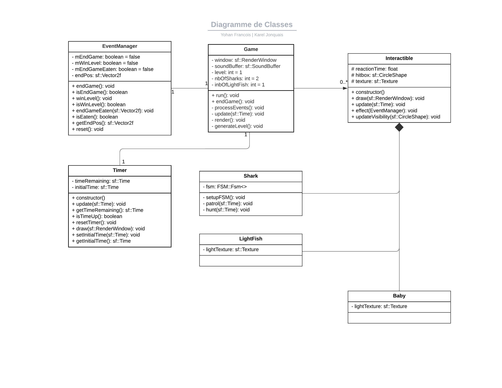

# Babyssal - Mini-Projet C++/SFML - VAP JIN Télécom SudParis - CSC4526

## Présentation du Projet

Ce projet consiste à développer un jeu vidéo en C++ utilisant la bibliothèque SFML (Simple and Fast Multimedia Library) pour la gestion des graphiques, des sons et des entrées. Le concept du jeu est le suivant :

- Le joueur est dans le noir complet.
- Le seul point de lumière est autour de la souris avec un rayon défini.
- Lorsque la souris s'approche d'un objet "Interactible" (un objet interactif), cet objet apparaît à l'écran (seule la partie éclairée est visible).
- Si l'objet est éclairé pendant plus d'un certain temps, l'effet de cet objet s'active.
- Le but est de trouver un bébé parmi tous les objets interactifs avant la fin du chronomètre.
- Lorsque le bébé est trouvé, le chronomètre se réinitialise, de nouveaux objets interactifs apparaissent aléatoirement, et le jeu recommence.
- À chaque niveau, plus d'objets interactifs apparaissent et le chronomètre devient plus court.

## Diagramme de classes

Le diagramme de classes ci-dessus montre les principales classes et leurs relations dans le projet.

## Classes et Fonctions clés

### `Game`

La classe `Game` est la classe principale du projet. Elle gère la boucle principale du jeu, les événements, les mises à jour et les rendus.

#### Fonctions clés

1. `void run()`: Fonction principale qui exécute la boucle principale du jeu.
2. `void processEvents()`: Fonction qui gère les événements du jeu.
3. `void update()`: Fonction qui met à jour les éléments du jeu.
4. `void render()`: Fonction qui dessine les éléments du jeu.
5. `void handlePlayerInput()`: Fonction qui gère les entrées du joueur.

### `Interactible`

La classe `Interactible` est la classe de base pour tous les objets interactifs du jeu. Elle contient les propriétés et les méthodes communes à tous les objets interactifs.

#### Fonctions clés

1. `void update()`: Fonction qui met à jour l'objet interactif en fonction du temps écoulé.
2. `void draw()`: Fonction qui dessine l'objet interactif.
3. `void effect()`: Fonction qui active l'effet de l'objet interactif.

### `Baby`

La classe `Baby` est une classe dérivée de la classe `Interactible`. Elle représente l'objet que le joueur doit trouver pour passer au niveau suivant.

### `LightFish`

La classe `LightFish` est une classe dérivée de la classe `Interactible`. Elle représente un poisson lumineux qui éclaire les objets autour de lui.

### `Shark`

La classe `Shark` est une classe dérivée de la classe `Interactible`. Elle représente un requin qui mange les objets autour de lui.

### `Timer`

La classe `Timer` est une classe utilitaire qui gère le temps écoulé dans le jeu.

#### Fonctions clés

1. `void update()`: Fonction qui met à jour le temps écoulé.
2. `void resetTimer()`: Fonction qui réinitialise le temps écoulé.
3. `void draw()`: Fonction qui dessine le temps écoulé à l'écran.

### `EventManager`

La classe `EventManager` est une classe utilitaire qui gère les événements du jeu et les transitions.

## Dossier `resources`

Le dossier `resources` contient tous les fichiers nécessaires au jeu, tels que les images, les sons et les polices. Il contient également un shader pour l'effet de lumière.

## Perspectives d'Amélioration

1. Ajouter plus d'objets interactifs avec des effets différents, positifs ou négatifs.
2. Ajouter des niveaux avec des objectifs différents.
3. Rendre le jeu plus interactif en ajoutant des mécanismes de jeu supplémentaires.
4. Ajouter des effets sonores et de la musique pour améliorer l'immersion.
5. Rendre le jeu plus esthétique en améliorant les graphismes et les animations.

## Créateurs

Ce projet a été réalisé par Yohan FRANCOIS et Karel JONQUAIS.

